# [NetflixGPT](https://netflix-gpt-six-tau.vercel.app/)

Welcome to NetflixGPT, the go-to website for in-depth movie exploration.NetflixGPT is more than a website; it's your ultimate movie encyclopedia. Dive into trailers, explore cast and crew details, unravel plot summaries, enjoy trivia, and stay informed with ratings and reviews. Experience movies like never before! 🍿🌟

## Table of Contents

- [Tech Marvels](#tech-marvels)
- [Key Features](#key-features)
- [Technology Used](#tectnology-ysed)
- [Getting Started](#getting-started)
- [Screenshots](#screenshots)

## Tech Marvels:

- Form Validation
- Firebase Authentication (Login/Logout)
- React Router Dom for seamless routing
- TMDB API for a vast movie database
- OpenAI API for intelligent movie searches
- Multilingual Support
- Netflix & IMDb-inspired UI with Tailwind CSS
- Redux Toolkit for efficient state management
- Responsive design for mobile devices
- Memoization for optimized performance

## Key Features:

### Login/Signup:

- Streamlined sign-in/sign-up forms
- Effortless redirection to the browse page post-authentication

### Browse Page (After Authentication):

- Intuitive Header
- Main Movie Section with:
  - Background Trailer
  - Title and Description
  - Movie Suggestions

### NetflixGPT:

- Dynamic Search Bar
- Personalized Movie Suggestions

### Movie Page:

- Watch Trailers
- Access Reviews and Ratings
- Add to Favorites
- Add to Watchlist
- Explore Movie Suggestions

## Technologies Used

- **React.js**: A popular JavaScript library for building user interfaces.

- **Tailwind CSS**: A utility-first CSS framework for rapidly building custom designs.

- **Redux Toolkit**: A state management library that simplifies the management of application state.

- **Firebase**: A backend-as-a-service platform for authentication and real-time database support.

- **TMDB API**: The Movie Database API is used to fetch movie and TV show data.

- **OpenAI API**: The OpenAI API is used for advanced movie search functionality using GPT.

- **npm create-react-app**: A tool for setting up a new React.js project quickly.

## Getting Started

To get started with NetflixGPT on your local machine, follow these steps:

1. Clone this repository:

   ```bash
   git clone https://github.com/yourusername/NetflixGPT.git
   ```

2. Change to the project directory:

   ```bash
   cd NetflixGPT
   ```

3. Install the project dependencies:

   ```bash
   npm install
   ```

4. Create a Firebase project and configure it with your Firebase credentials.

5. Create an OpenAI account and obtain an API key.

6. Set up your environment variables with the necessary API keys and configurations.

7. Start the development server:

   ```bash
   npm start
   ```

8. Access the application in your web browser at `http://localhost:3000`.

## Screenshots

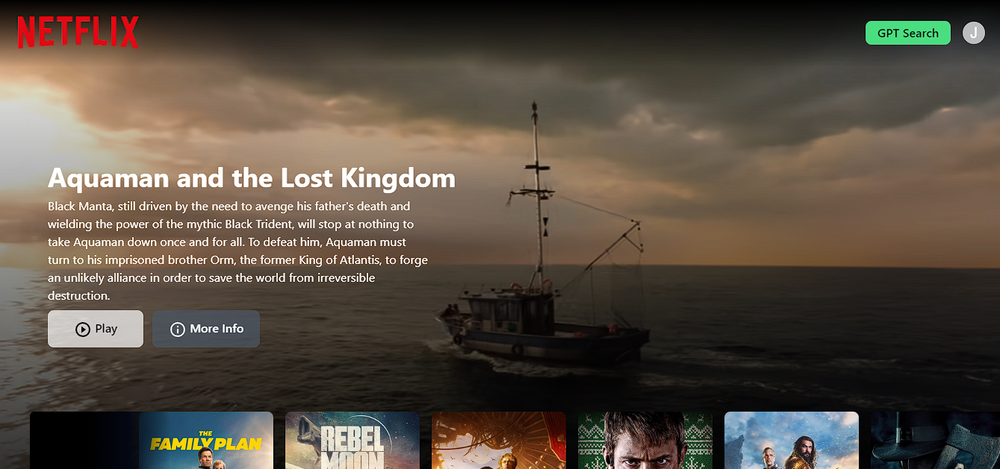

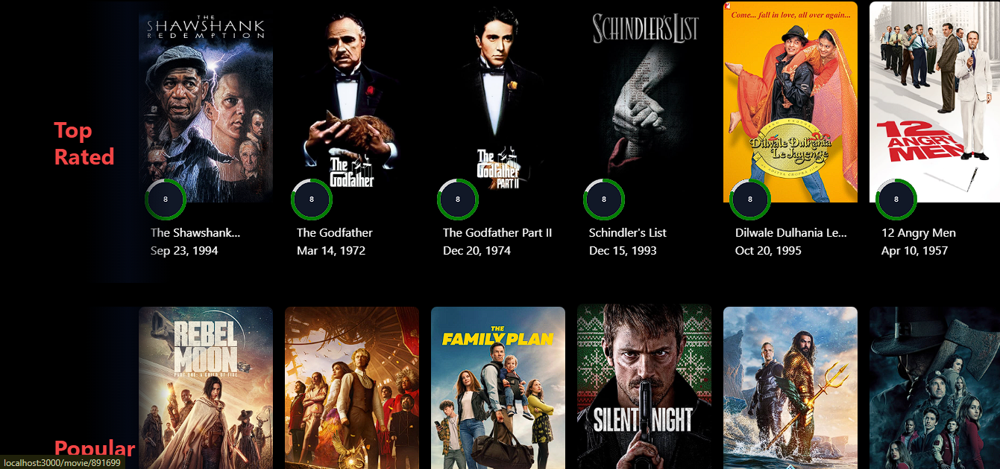
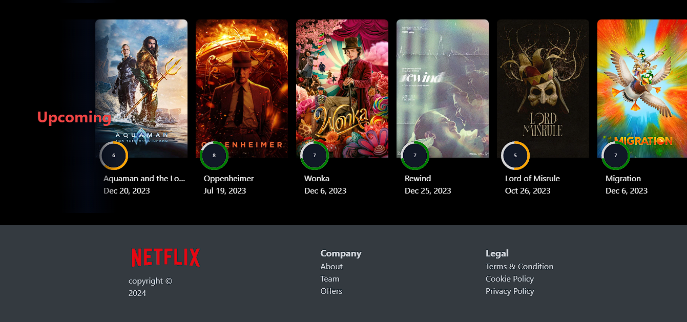
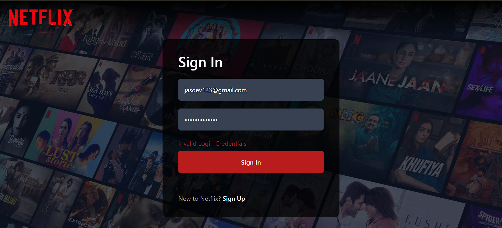
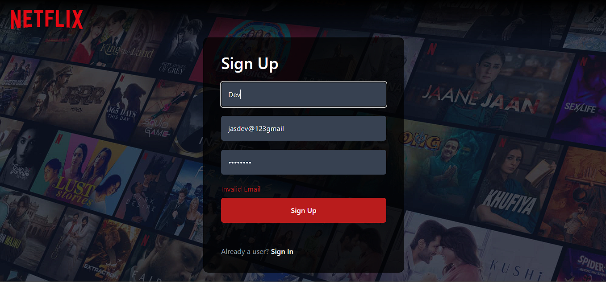
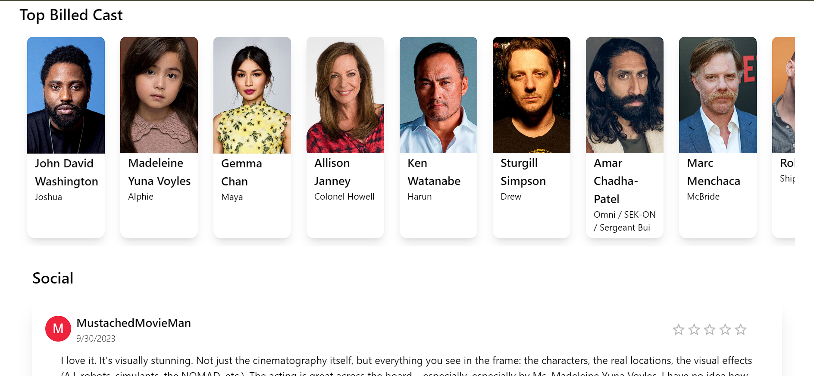
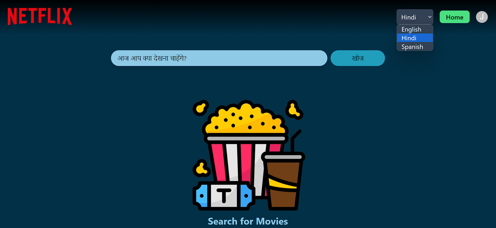
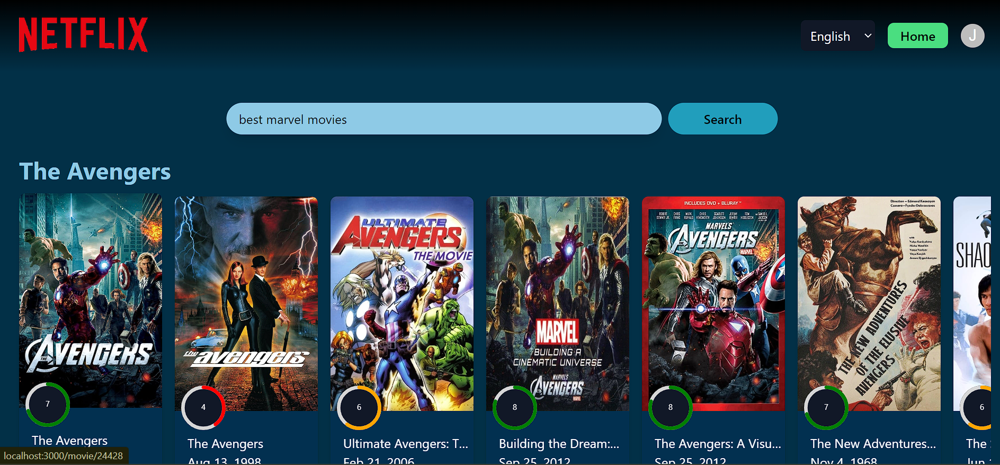
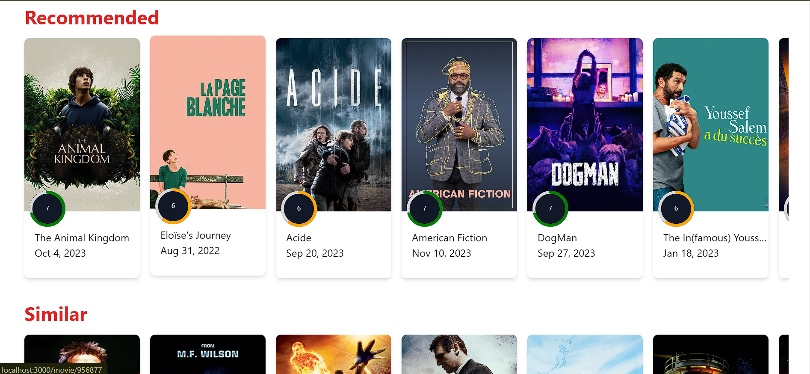
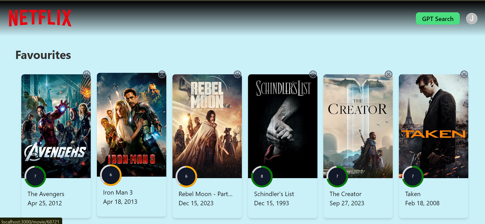
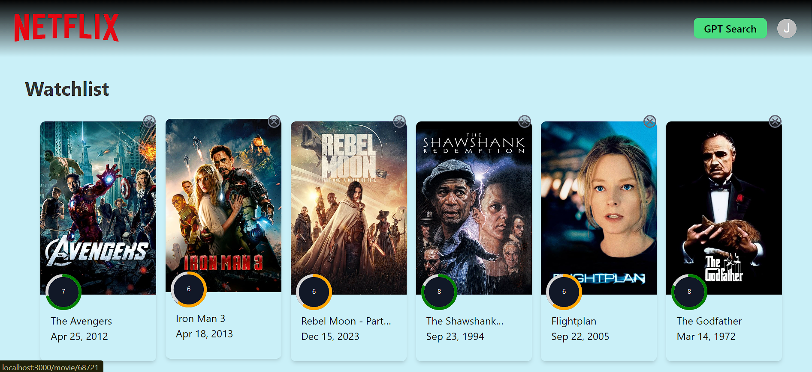

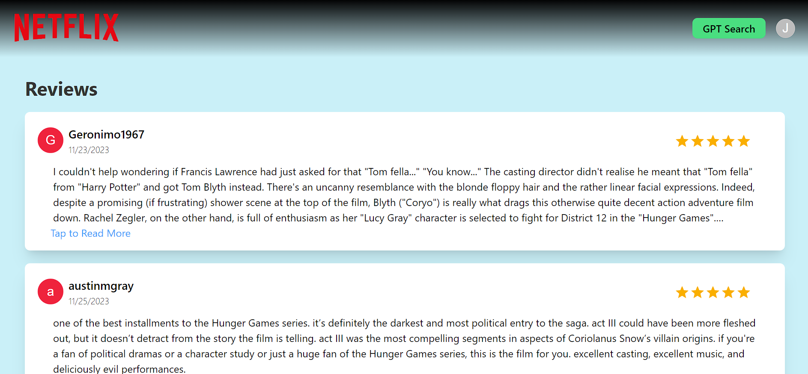

## Explore NetflixGPT:

Dive in now on [NetflixGPT](https://netflix-gpt-six-tau.vercel.app/) and explore the code on [GitHub](insert-your-GitHub-link-here).

Happy Exploring! 🚀
