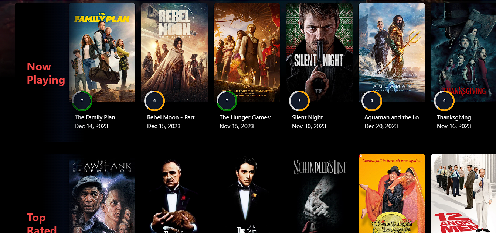

# NetflixGPT

NetflixGPT is a modern web application that allows users to discover and explore a wide range of movies and TV shows. This project is built using React.js, Tailwind CSS, Redux Toolkit for state management, Firebase for authentication, the TMDB API for fetching movie data, and the OpenAI API for powerful movie search capabilities. NetflixGPT is designed with several key functionalities, including authentication, form validation, dynamic user interface, an advanced GPT search to find any type of movie, responsive design, and multilingual support.

## Table of Contents

- [Features](#features)
- [Technologies Used](#technologies-used)
- [Getting Started](#getting-started)
- [Screenshots](#screenshots)

## Features

- **Authentication**: Users can create accounts and sign in using Firebase authentication. This ensures a secure and personalized experience.

- **Form Validation**: Form inputs are validated to provide a smooth and error-free user experience.

- **Dynamic UI**: The user interface adapts to display relevant information and details for each selected movie or TV show.

- **GPT Search**: The application integrates the OpenAI API to provide powerful and accurate search functionality. Users can search for any type of movie with ease.

- **Responsive Design**: NetflixGPT is designed to work on various screen sizes and devices, providing an optimal user experience on desktops, tablets, and mobile phones.

- **Multilingual Functionality**: The application supports multiple languages, making it accessible to a diverse user base.

## Technologies Used

- **React.js**: A popular JavaScript library for building user interfaces.

- **Tailwind CSS**: A utility-first CSS framework for rapidly building custom designs.

- **Redux Toolkit**: A state management library that simplifies the management of application state.

- **Firebase**: A backend-as-a-service platform for authentication and real-time database support.

- **TMDB API**: The Movie Database API is used to fetch movie and TV show data.

- **OpenAI API**: The OpenAI API is used for advanced movie search functionality using GPT.

- **npm create-react-app**: A tool for setting up a new React.js project quickly.

## Getting Started

To get started with NetflixGPT on your local machine, follow these steps:

1. Clone this repository:

   ```bash
   git clone https://github.com/yourusername/NetflixGPT.git
   ```

2. Change to the project directory:

   ```bash
   cd NetflixGPT
   ```

3. Install the project dependencies:

   ```bash
   npm install
   ```

4. Create a Firebase project and configure it with your Firebase credentials.

5. Create an OpenAI account and obtain an API key.

6. Set up your environment variables with the necessary API keys and configurations.

7. Start the development server:

   ```bash
   npm start
   ```

8. Access the application in your web browser at `http://localhost:3000`.

## Screenshots





